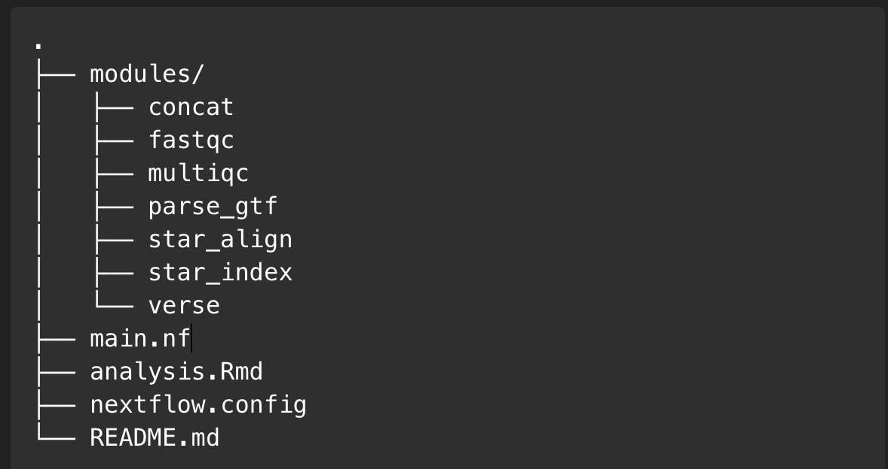

# Project_1_RNA-Seq_Analysis_Pipeline_BF528_BU

## Overview

This repository contains a complete RNA-seq analysis pipeline implemented using Nextflow. The pipeline encompasses quality control (QC), alignment of sequencing reads, quantification of gene expression, and preparation for downstream differential expression analysis.

Downstream analyses, including Differential Expression (DESeq2) and Gene Set Enrichment Analysis (fgsea), are provided in an R Markdown notebook.

Note: Due to storage constraints, intermediate and output data files generated by the pipeline are not included in this repository.

## Pipeline Workflow

The workflow performs the following steps:

Quality Control (FastQC): Assesses sequencing read quality.

Reference Indexing (STAR): Builds genome index for alignment.

GTF Parsing: Prepares annotation files for analysis.

Alignment (STAR): Aligns sequencing reads to reference genome.

MultiQC: Summarizes QC and alignment metrics.

Quantification (VERSE): Generates count matrices for downstream analyses.

Concatenation: Combines individual sample counts into a unified dataset.

## Repository Structure

## Requirements

Nextflow (https://www.nextflow.io/)

Docker/Singularity

STAR aligner

VERSE

FastQC

MultiQC

R and associated packages (DESeq2, fgsea, etc.)

## Downstream Analysis

The Week3.Rmd notebook contains detailed downstream analyses, including:

Differential expression analysis (DESeq2)

Gene Set Enrichment Analysis (fgsea)

Open the R Markdown notebook to explore and reproduce the analysis steps.
